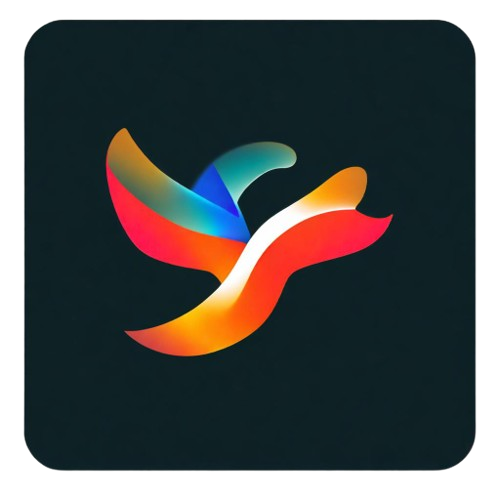

# AaramSe - Digital Queue & Smart Appointment Solution


**AaramSe** (Hindi for "With Ease") is a premium digital solution designed to eliminate physical waiting lines. Whether it's a doctor's clinic, a retail store, or a service center, AaramSe bridges the gap between service providers and customers with real-time queue tracking and smart scheduling.

---

## 🚀 Product by [HarIT Tech Solution](https://harittech.vercel.app/)
Building digital bridges for a better tomorrow.

## 📱 Features

### For Users (Customers)
- **Live Queue Tracking**: Watch your position in the queue live from your mobile.
- **Smart Slot Booking**: Pre-book your arrival to avoid peak hours.
- **Proactive Notifications**: Receive sound alerts and notifications for your turn.
- **Search & Discover**: Find verified clinics, stores, and services near you.
- **History**: Track all your past and upcoming appointments in one place.

### For Partners (Store/Clinic Owners)
- **Digital Dashboard**: Manage your daily flow with a real-time analytics dashboard.
- **Slot Control**: Customize booking slots, holidays, and availability instantly.
- **Customer Management**: Mark attendees, handle cancellations, and view customer history.
- **Business Branding**: Showcase your services with custom images and descriptions.
- **QR Integration**: Generate and download unique QR codes for your storefront.

## 🛠️ Tech Stack

### Frontend (Mobile App)
- **React Native (Expo)**: Cross-platform mobile excellence.
- **NativeWind (Tailwind CSS)**: For premium, responsive UI styling.
- **Expo Notifications**: For reliable real-time alerts.
- **React Navigation**: Seamless screen-to-screen flow.
- **Axios**: robust API communication.

### Backend (Server)
- **Node.js & Express**: High-performance API architecture.
- **MongoDB (Atlas)**: Scalable NoSQL database management.
- **JWT (JSON Web Tokens)**: Secure, stateless authentication.
- **Render**: Deployed and managed on a premium cloud platform.

## 📦 Installation & Setup

### Prerequisites
- [Node.js](https://nodejs.org/) (v16+)
- [Expo CLI](https://docs.expo.dev/get-started/installation/)
- [MongoDB Atlas Account](https://www.mongodb.com/cloud/atlas)

### Steps

1. **Clone the Project**
   ```bash
   git clone https://github.com/HarITTech/Aaramse_1.0.git
   cd Aaramse_1.0
   ```

2. **Backend Setup**
   ```bash
   cd backend
   npm install
   # Create a .env file with:
   # MONGO_URI, JWT_SECRET, PORT
   npm start
   ```

3. **Frontend (Appoint) Setup**
   ```bash
   cd Appoint
   npm install
   npx expo start
   ```

## 📄 License
This project is licensed under the MIT License - see the [LICENSE](LICENSE) file for details.

## 🌐 Connect with Us
- **Website**: [HarIT Tech Solution](https://harittech.vercel.app/)
- **Email**: harittech@gmail.com
- **Product Name**: AaramSe (आरामSe)

---
**AaramSe – क्यू से छुटकारा, आराम से समाधान।**
*Designed and Developed with ❤️ by HarIT Tech Solution.*
